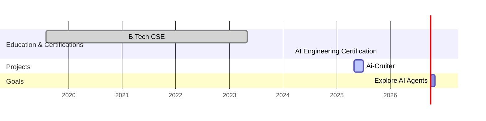

<!-- Replace “subtler” with your GitHub username everywhere!  
Save this as `README.md` in a repository named exactly your username. -->

# 👋 Hey, I’m Shahe Sheik Shafeequdeen (subtler)

I’m an **AI Engineer** passionate about solving real-world problems with NLP, Transformers & LLMs.  
I believe in **“One more rep — both in the gym and in life.”** Always shipping, always learning.

---

## 🧠 About Me

- 🎯 **Currently:**  
  - Building **Ai-Cruiter** (AI-powered resume matcher with OpenAI, Pinecone & Streamlit)  
  - Exploring **Prompt Engineering** & **LangChain**  
  - Automating business insights for **No Gym** (local premium gym)  
- 📍 **Location:** Thiruvarur, Tamil Nadu  
- 💼 **Portfolio:** [github.com/subtler](https://github.com/subtler)  
- 🌐 **LinkedIn:** [linkedin.com/in/shafeequdeen](https://linkedin.com/in/shafeequdeen)

---

## 🛠️ Tech Stack

**Languages:**  
  

**AI/ML Frameworks:**  
  

**Dev Tools & DevOps:**  
   

---

## 📈 GitHub Stats & Activity

  
  

---

## 🚀 Featured Projects

- 🧩 [Ai-Cruiter](https://github.com/subtler/Ai-Cruiter)  
  *AI-powered resume matcher using OpenAI, Pinecone & Streamlit*  
- 🌾 [Rice Yield Predictor](https://github.com/subtler/Rice-Yield-Predictor)  
  *Predicting rice yields for local rice mill owners*  
- 🔍 [Credit Fraud Detection](https://github.com/subtler/Credit-Scoring)  
  *Random Forest credit default model*

---

## 📝 Latest Blog Posts

<!-- BLOG-POST-LIST:START -->
<!-- BLOG-POST-LIST:END -->

---

## 📅 Career Timeline

## 🌐 Let’s Connect

  
  

